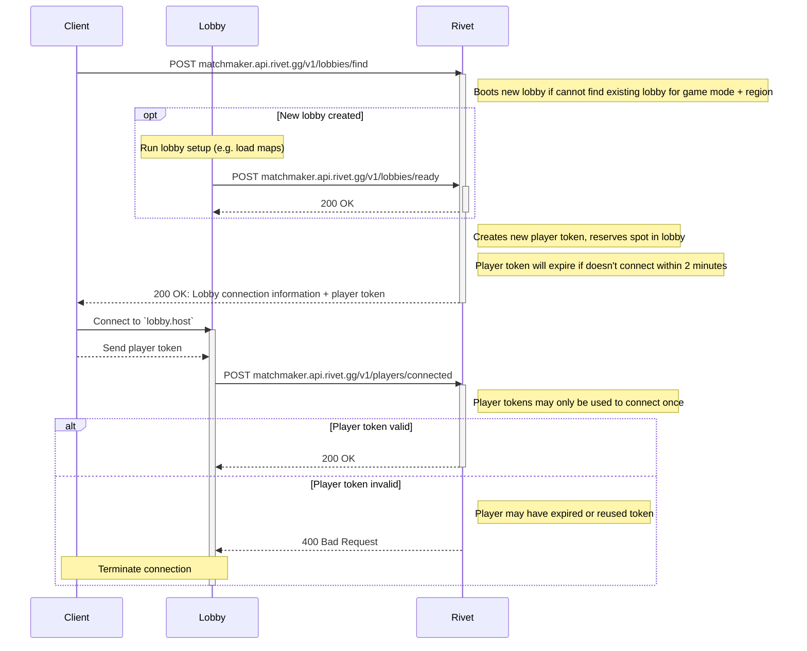
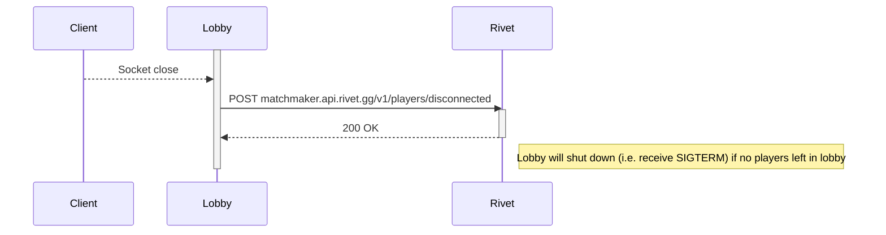

# Matchmaker Flow

## Player connection & lobby creation

```mermaid
sequenceDiagram

participant C as Client
participant L as Lobby
participant R as Rivet

C->>R: POST matchmaker.api.rivet.gg/v1/lobbies/find
activate R
note right of R: Boots new lobby if cannot find existing lobby for game mode + region

opt New lobby created
	note over L: Run lobby setup (e.g. load maps)
	L->>R: POST matchmaker.api.rivet.gg/v1/lobbies/ready
	activate R
	R-->>L: 200 OK
	deactivate R
end

note right of R: Creates new player token, reserves spot in lobby
note right of R: Player token will expire if doesn't connect within 2 minutes
R-->>C: 200 OK: Lobby connection information + player token
deactivate R


C->>L: Connect to `lobby.host`
activate L
C-->>L: Send player token

L->>R: POST matchmaker.api.rivet.gg/v1/players/connected
activate R
note right of R: Player tokens may only be used to connect once
alt Player token valid
	R-->>L: 200 OK
	deactivate R
else Player token invalid
	note right of R: Player may have expired or reused token
	R-->>L: 400 Bad Request
	Note over C,L: Terminate connection
end

deactivate L

```

## Player disconnection

```mermaid
sequenceDiagram

participant C as Client
participant L as Lobby
participant R as Rivet

activate L
C-->>L: Socket close

L->>R: POST matchmaker.api.rivet.gg/v1/players/disconnected
activate R
R-->>L: 200 OK
deactivate R

note right of R: Lobby will shut down (i.e. receive SIGTERM) if no players left in lobby

deactivate L
```

